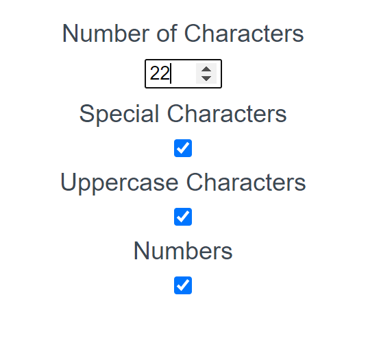

# Password-Gen
Generate random passwords with Javascript 

Find the live app at https://angeleefshaw.github.io/Password-Generator/

# Description 

Use this simple application to generate a random password. 

# Demo 

Before generating your password, you can specify what characters to include in the inputs below. Select the length of your password using the textbox within the 'Number of Characters' section. Improve the security of your password by selecting at least one or all of the checkboxes labeled 'Special Characters', 'Uppercase Characteres' and 'Numbers'.

When finished with customizing inputs, click the red 'Generate Password' button displayed in the photo below. Your custom password will be displayed in the textbox provided. Press the generate button as many times as needed to find a secure password.

# About the Code 

# Liscense 